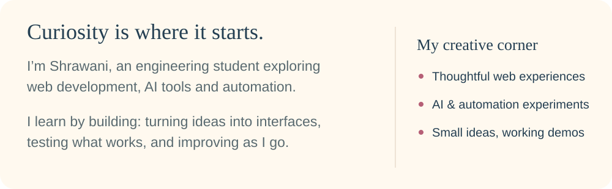
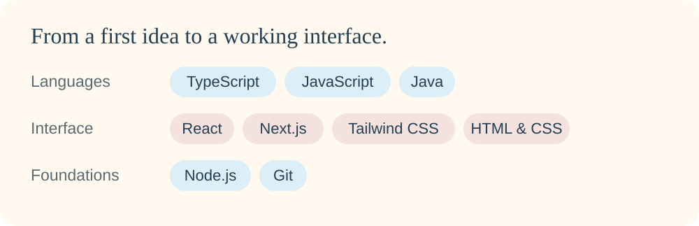
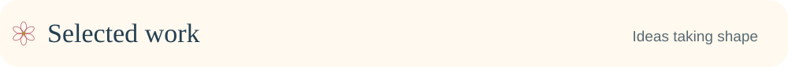
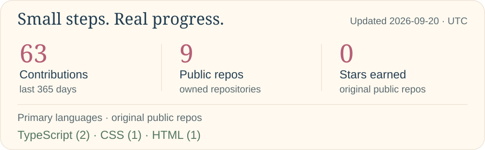
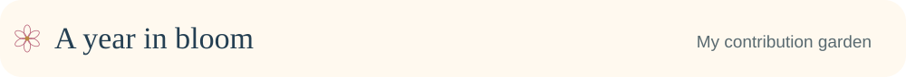
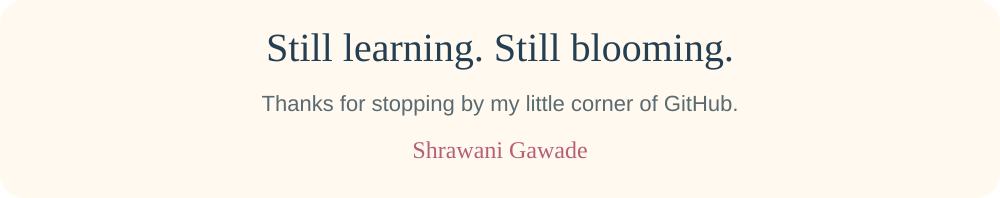

<!-- Native SVG artwork. Rebuild with python3 scripts/build_assets.py and scripts/build_readme.py. -->

  <picture>
    <source media="(max-width: 600px)" srcset="assets/sg/hero-mobile.svg"/>
    
  </picture>

 
  <picture>
    <source media="(max-width: 600px)" srcset="assets/sg/section-dossier-mobile.svg"/>
    
  </picture>

  <picture>
    <source media="(max-width: 600px)" srcset="assets/sg/dossier-mobile.svg"/>
    
  </picture>

 
  <picture>
    <source media="(max-width: 600px)" srcset="assets/sg/section-equipment-mobile.svg"/>
    
  </picture>

  <picture>
    <source media="(max-width: 600px)" srcset="assets/sg/equipment-mobile.svg"/>
    
  </picture>

 
  <picture>
    <source media="(max-width: 600px)" srcset="assets/sg/section-contracts-mobile.svg"/>
    
  </picture>

  <a href="https://github.com/shrawaniGawade/deepattend">
  <picture>
    <source media="(max-width: 600px)" srcset="assets/sg/contract-1-mobile.svg"/>
    
  </picture>
  </a>

  <a href="https://github.com/shrawaniGawade/CodeGuardian">
  <picture>
    <source media="(max-width: 600px)" srcset="assets/sg/contract-2-mobile.svg"/>
    
  </picture>
  </a>

 
  <picture>
    <source media="(max-width: 600px)" srcset="assets/sg/section-statistics-mobile.svg"/>
    
  </picture>

  <picture>
    <source media="(max-width: 600px)" srcset="assets/generated/stats-mobile.svg"/>
    
  </picture>

 
  <picture>
    <source media="(max-width: 600px)" srcset="assets/sg/section-surveillance-mobile.svg"/>
    
  </picture>

  <a href="https://github.com/shrawaniGawade?tab=overview">
  <picture>
    <source media="(max-width: 600px)" srcset="assets/generated/contribution-garden-mobile.svg"/>
    
  </picture>
  </a>

 
  <picture>
    <source media="(max-width: 600px)" srcset="assets/sg/section-contact-mobile.svg"/>
    
  </picture>

  <a href="https://github.com/shrawaniGawade">
  <picture>
    <source media="(max-width: 600px)" srcset="assets/sg/contact-mobile.svg"/>
    
  </picture>
  </a>

 

  <picture>
    
  </picture>
  <picture>
    <source media="(max-width: 600px)" srcset="assets/sg/complete-mobile.svg"/>
    
  </picture>

